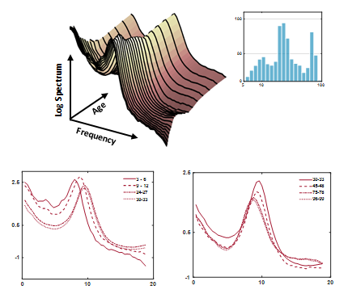
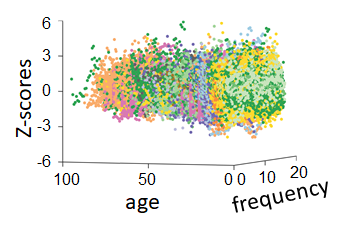

# HarMNqEEG

**HarMNqEEG: provide the MATLAB code for the evaluation of batch harmonized z-scores based on the Multinational Multivariate EEG Norm.**

Descriptive parameter surface (DPs):

Z socre values:

## Installation

1. Extract the ZIP file (or clone the git repository) somewhere you can easily reach it.
2. Add the HarMNqEEG folder to your path in MATLAB: e.g.
   a. using the "setup" dialogue in MATLAB;
   b. by running the addpath function from your command window or startup script.
   Note: this package requires Matlab R2021a or latter since the gridded norm from non-uniform samples utilizes `griddedInterpolant` to interpolate multiple sets of values on the same grid for the incoming sample.

## Usage

Folder main contains the main process code including:

Generate corss-spectrum tensor use the code data_gatherer.m [1].

The  data_gatherer.m and one example named generate_cross_spectrum.m in the external folder.

notes:

1. check the electrodes name and electrodes order used in data_gatherer.m
2. names shoule be encrypted before generate the corss-spectrum tensor.

**step 0**: generate metadata table based on the calcuated cross-spectrum tensor.

> input: corss-spectrum tensor path  
output: metadata table Ⅰ

you can chekc the example with: *.\data\example\DataInfo_Barbados1978Malnutrition_44.csv*

**step 1**: run step1_preprocess_`<typeDPs>`.m  to get the DPs

> input: metadata table  Ⅰ   
output: DPs table Ⅱ which including log-spectrum /Riemannian vectorized corss-spectrum DPs +meta data

**step 2**: run step2_harmonize_`<typeDPs>`.m to get the global z-scores, batch harmonized z-scores and batch harmonized DPs

> input:  DPs table Ⅱ+{ study name, batch correction reference study name}(the reference batch study name as below)    
output: z-score table Ⅲ which including  z-scores (global z-scores) and cz-scores (batch corrected z-scores)

**step 3**: run step3_visualize_`<typeDPs>`.m to visualize the scatter plot of z-scores

> input:  z-score table Ⅲ       
output: z-score scatter plot

Note:

1. `<typeDPs>` including traditional log-spectrum DPs (`log`) and Hermitian Riemannian DPs (`riemlogm`).
2. In **step 2**, need to select one closed study for calculating batch harmonized z-scores and DPs.
   The name of existed batch reference are:

>   'ANTNeuro Malaysia'  
   'BrainAmpDC Chengdu'  
   'BrainAmpMRplus Chongqing'  
   'BrainAmpMRplus Germany'  
   'DEDAAS Barbados1978'  
   'DEDAAS NewYork'  
   'EGI Zurich'  
   'Medicid-3M Cuba1990'  
   'Medicid-4 Cuba2003'  
   'Medicid-5 CHBMP'  
   'NihonKohden Bern'  
   'actiChamp Russia'  
   'neuroscan Colombia'  
   'nvx136 Russia'  
3. Based on model comparison, the norm is a variable of age and frequency, so it shows as an EEG development surface for narrow-band EEG DPs.

## Example Data Description

The data is available on Synapse https://doi.org/10.7303/syn26712979, extract data folder to the root of the repository. The data include:

1. **example**:
   a. BarbadosMalnutrition contains the cross-spectrum tensor of Barbados 1978 malnutrition dataset [2] which got by running **the data_gatherer.m**
   Note: take care with the EEG epoch which will use in step2 for Hermitian positive defined (HPD) matrix regularization[3].
   the path of the cross-spectrum should include the path and name of .mat file which will be used for load data in **step 2**.
2. **norm**:
   Including norms norm_`<typeDPs>`_`<model>`_`<batch>`.mat for calculating the global z-scores and batch harmonized z-scores for `<typeDPs>` and the geometric mean for mapping the cross-spectrum tensor to tangent vector space in step and this only need for Hermitian Riemannian DPs Preprocessing.

## Remarks

1. HarMNqEEG norms including 11 studies, see in the paper (HarMNqEEG). We now only support these 11 studies and when running **step 2**, choose the closed one for harmonization.
   In future work, we will provide the function for estimating the batch norms of coming to DPs.
2. Octave is not fully supported yet.

## Reference:  

>[1] Github location of the script: https://github.com/CCC-members/BC-V_group_stat/blob/master/data_gatherer.m  
[2] Bringas Vega, M.L., Guo, Y., Tang, Q., Razzaq, F.A., Calzada Reyes, A., Ren, P., Paz Linares, D., Galan Garcia, L., Rabinowitz, A.G., Galler, J.R., Bosch-Bayard, J., Valdes Sosa, P.A., 2019. An -Adjusted EEG Source Classifier Accurately Detects School-d Barbadian Children That Had Protein Energy Malnutrition in the First Year of Life. Front. Neurosci. 13, 1222. https://doi.org/10.3389/fnins.2019.01222  
[3] Schneider-Luftman, D., Walden, A.T., 2016. Partial Coherence Estimation via Spectral Matrix Shrinkage under Quadratic Loss. IEEE Trans. Signal Process. 64, 5767–5777. https://doi.org/10.1109/TSP.2016.2582464

Author: Ying Wang, Min Li, Pedro Antonio Valdés-Sosa.  

Please cite: 
>Li, M., Wang, Y., Lopez-Naranjo, C., Hu, S., Reyes, R.C.G., Paz-Linares, D., Areces-Gonzalez, A., Hamid, A.I.A., Evans, A.C., Savostyanov, A.N., Calzada-Reyes, A., Villringer, A., Tobon-Quintero, C.A., Garcia-Agustin, D., Yao, D., Dong, L., Aubert-Vazquez, E., Reza, F., Razzaq, F.A., Omar, H., Abdullah, J.M., Galler, J.R., Ochoa-Gomez, J.F., Prichep, L.S., Galan-Garcia, L., Morales-Chacon, L., Valdes-Sosa, M.J., Tröndle, M., Zulkifly, M.F.M., Abdul Rahman, M.R.B., Milakhina, N.S., Langer, N., Rudych, P., Koenig, T., Virues-Alba, T.A., Lei, X., Bringas-Vega, M.L., Bosch-Bayard, J.F., Valdes-Sosa, P.A., 2022. Harmonized-Multinational qEEG norms (HarMNqEEG). NeuroImage 256, 119190. https://doi.org/10.1016/j.neuroimage.2022.119190

Create Time: 2021

Copyright(c): 2020-2022 Ying Wang, <yingwangrigel@gmail.com>; Min Li, <minli.231314@gmail.com>; Pedro Antonio Valdés-Sosa <pedro.valdes@neuroinformatics-collaboratory.org>

Joint China-Cuba LAB, UESTC, Chengdu, China.
